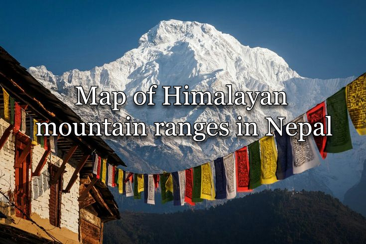

   

- - -

 

## Context 
Nepal's northern mountain ranges are one of the tallest and rugged terrains in the world formed by the Indian continental plate smashing into the Eurasian plate around 140 million years ago. This violent geological compression resulted in the land being pushed out vertically and forming the Himalayan mountain ranges we have today that spreads across Nepal, China, India, Pakistan, and Bhutan. 

It should be noted that the map has labels for mountains above the 7km (4.35 miles) elevation range. There are over a hundred mountains below that range, so this map only showcases the more well-known ones that are worth labeling. Although it's not the best map work on this subject, the important details have been layed out for infographic purposes. 

This map is just a hobby project of mine to learn how to map topological areas using GIS software. Another reason is to serve as a personal guide map for future mountaineering expeditions that I'm planning in a few years. It's not anything impressive nor interesting in the general sense, but it's still something I wanted to showcase and publish as a love letter to the beauty of Himalayan mountains. 

## Data sources
- DEM: ArcGis Global DEM
- GIS Software: ArcGIS
- Mountain coordinates: https://en.wikipedia.org/wiki/List_of_mountains_in_Nepal
- Mountain spreadsheet (from wikipedia): [here](full_list.xlsx)

## Credits
Made by kernelwernel, 2026. Crediting my work is not strictly necessary since I consider this to be in the public domain, but a mention/link to this repository would be appreciated!

License: CC0-1.0