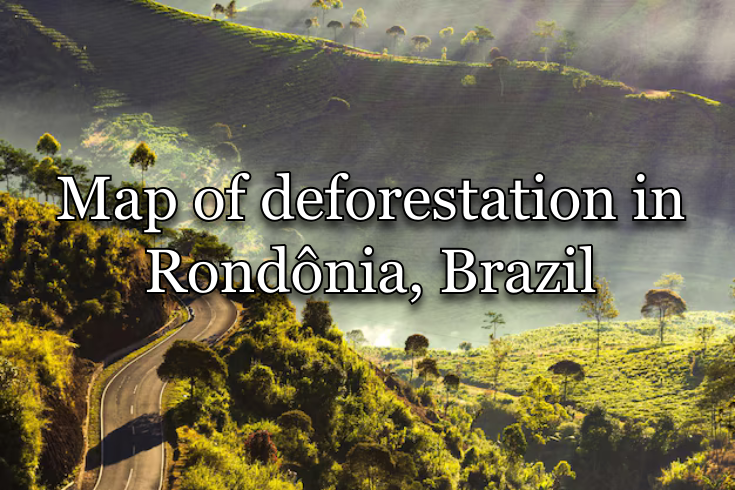
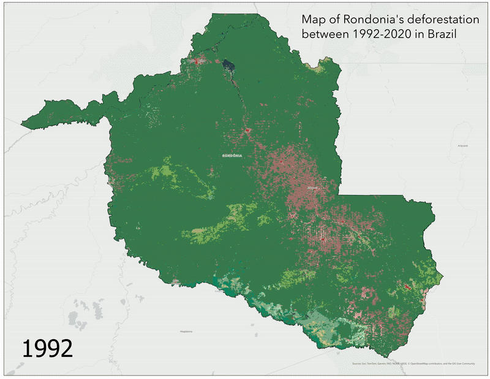

   

- - -

 

## Context 

Rondônia is a state in west-central Brazil, bordering Bolivia. It's known for its dense vegetation and its rich forests that contribute to reducing CO2 levels in the atmosphere as a major carbon sink. Part of the Amazon Rainforest, it is considered as one of the frontiers of regulating carbon fluxes by reducing greenhouse gas concentrations. 

However, Rondônia over the past few decades has experienced a significant amount of deforestation and land reuse for croplands due to a growing farming industry and civil infrastructure projects being developed. This has greatly damaged the integrity of Rondônia's biodiversity and richness in vegetation over the past few decades. 

The aim of this mapping analysis is to quantify and visualise the extent of the deforestation taking place between the years of 1992-2020, and analyse the destabilisation of Rondônia's vegetation. Additionally, this data will critically tie into what this means not just for Rondônia, but also for Brazil's ecological integrity. 

 

# Methodology 
The methodology regarding the capture of the data shown in the tables and map have been outsourced from satellite data and geospatial remote sensing. The land is classified into many categories of land, such as Croplands, Urban Areas, Vegetation, and other miscellaneous lands. Croplands and Vegetation areas both have their own subcategories, which will be categorically merged together for the sake of data visualisation and simplification. 

 

# Results
The animated map showcases the full extent of the deforestation at hand. The brown colour that's expanding as seen in the map are croplands. The red colour represents man-made urban areas that were developed on top of vegetated ones, which are shown in green and greenish colour variants. The table provided in this repository in the [data_tables](data_tables) folder shows the extent of the deforestation quantitavely.

The spike from 1992 to 2000 has been the largest period of deforestation recorded in Rondônia, by an increase in croplands by 234% after 1992. Additionally, the deforestation correlates with the BR-364 highway's trajectory going through Rondônia. This shows a high correlation between civil infrastructure projects and the destruction of forests throughout the state.

 

# Credits
Made by kernelwernel, 2026. Crediting my work is not strictly necessary since I consider this to be in the public domain, but a mention/link to this repository would be appreciated!